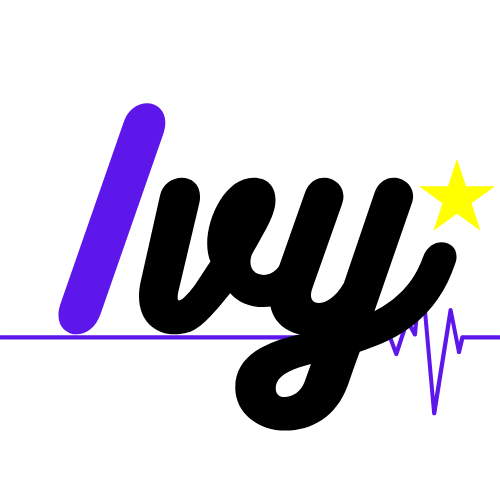

</a>

# Ivy

Es un Framework de desarrollo orientado 100% al desarrollo de microservicios con PHP. Esta basado en el patron de diseño Abstract Factory, lo cual nos permite crear una clase PHP para cada enpoint. Esta diseñado para trabajar exclusivamente con data, mediente el manejo de Request y Response. 

La vision de Ivy es poder facilitar la creacion de API's Ivy mediante la creacion de una clase que se encarge de procesar los metodos solicitados por el cliente

## ¿Como empiezo a usarlo?

Es muy sencillo, actualmente Ivy se encuentra en su primer realease y esta en los paquetes de composer, comenzar a usarlo es tan sencillo como teclear en tu terminal 

``$ composer create-project damiandev/ivy nombre_proyecto``

Esto te creara la carpeta nombre_proyecto, la cual contendra todo el codigo necesario para comenzar una aplicacion Ivy sencilla. 

> **Nota:** Es muy importante que despues de crear el proyecto se cree un documento ``.env`` con las siguientes constantes
> 
> APP_NAME 
>
> DB_HOST
> 
> DB_DATABASE
> 
> DB_USERNAME
> 
> DB_PASSWORD
>
> Las cuales son las variables globales de configuracion para Eloquent

## Entornos de desarrollo y produccion

### Servidor

El servidor es el equipo de computo en el que se ejecuta el programa, en terminos comunes: es la maquina en donde se ejecutan nuestros scripts php, en terminos de desarrollo lo podriamos comparar con el localhost.

Cuando nos disponemos a desarrollar una aplicacion php, es muy comun que nos dispongamos a instalar una serie de herramientas que nos permiten comenzar con la programación de nuestra aplicación, es aqui cuando comenzamos a investigar en los entornos de desarrollo, y nos encontramos con varios programas informaticos.

Un servidor web es un programa informatico que se encarga de procesar una aplicacion y realizar conexiones bidireccionales o unidireccionales, sincronicas o asincronicas con el cliente, generando una respuesta en cualquier lenguaje o aplicacion, para este caso hare bastante enfasis en dos tecnologias importantes [Apache](https://httpd.apache.org) y [Nginx](https://www.nginx.com), servidores web con mucha documentacion y con un uso bastante expandido.

En ambos casos es recomendable que si el servidor que se usará, es una instalacion limpia de alguno de estos, debemos configurar un ``Virtual Host`` para que este apunte a la carpeta ``Public/`` de nuestro proyecto Ivy.

### Peticiones (Request) y Respuestas (Response)

La comunicacion HTTP se basa en un modelo de solicitud/respuesta, de modo que hay dos tipos de solicitud hacia un servidor de informacion. Ambos mensajes contienen en una linea de entrada, una linea de salida y en ocaciones los mensajes contienen un cuerpo del mensaje. 

Estos objetos son interptretados por nuestro servidor web y son procesadas estas peticiones en el equipo de computo que recibe esta peticion.

La linea de salida o linea de peticion, siempre es la primeta linea del mensaje y contiene 3 campos:

- Un metodo HTTP
- Un identificador universal de recursos (URI)
- Una version del protocolo HTTP

Aunque existen varios metodos HTTP los mas usados son GET y POST. Tradicionalmente el metodo GET se usa para obtener un recurso en el servidor indicado en el campo URI y el metodo POST es usado para enviar explisitamente informacion al servidor. Este protocolo de intercabio de informacion ha sido la base de la construccion web actual y es algo que debemos tener bien en mente al momento de crear aplicaciones Ivy.

### Consideraciones

AL momento de desarrollar aplicaciones Ivy es importante tener en cuenta que la comunicacion y la construccion de la logica esta basada en ese intercambio de informacion entre el cliente y el servidor. Ivy nos permite crear aplicaciones robustas y altamente escalables al cambiar el patron de diseño tradicional **MVC** por **Abstract Factory**.

## Algunos entornos de desarrollo compatibles

### [Laragon](https://laragon.org)

La carpeta raiz del proyecto debe estar localizada en la carpeta www de tu carpeta de instalacion laragon. Para mas informacion consulta la [documentacion oficial](https://laragon.org/docs/install.html).

### [Valet](https://laravel.com/docs/7.x/valet)

En el caso de estar usando el entorno de desarrollo valet ya sea en MacOS o en Linux, es importante realizar un link simbolico de la aplicacion dentro de la carpeta ``Public/`` del proyecto que has creado. Bastaria con situarte con la terminal dentro de la carpeta ``Public/`` y ejecutar:

``$ valet link app_name``

Esto con la finalidad de hacer que la carpeta principal del servidor sea la carpeta ``Public/`` ejecutando el archivo ``index.php`` y las reglas contenidas en el archivo ``.htaccess``.

Con estas configuraciones basicas podremos ejecutar aplicaciones Ivy, si quieres mas informacion al respecto visita la [documentacion oficial](https://laravel.com/docs/7.x/valet).

## Funcionamiento de Ivy

Partiendo de los conceptos inciciales de esta documentación, Ivy trabaja con las peticiones que son enviadas al servidor, estas son analizadas y procesadas por un pequeño ``Kernel``, el cual tiene la función de disparar las acciones de validacion y de procesamiento de la informacion de entrada.

Todo comienza dentro de la carpeta ``Public/`` dentro de la cual tendremos nuestro script de inicio, acompañado de un archivo de configiracion de servidor ``.htaccess``. Este script lo unico que contiene es la instanciacion y la ejecucion de nuestra clase ``Kernel`` y la carga de las librerias:

- [phpdotenv](https://github.com/vlucas/phpdotenv)
- [Woops](https://filp.github.io/whoops/)

Que sirven para cargar variables de entorno en documentos .env y muestra de errores con estilo, respectivamente.

### Carpeta Core

Dentro de la carpeta ``Core`` se encuentra todo el codigo necesario para que la aplicacion Ivy funcione, dentro podemos localizar 4 clases php y una clase abstracta.

- La clase Kernel: Contiene solo un metodo publico ``run()``, el cual genera una instancia del validador de peticiones, evalua el status de la peticion y ejecuta el disparador ``Genesis``.

- La clas Validador: Esta clase contiene una serie de validaciones por defecto para todas las peticiones ademas de que es la clase encargada de crear el objeto Response que sera servido al cliente. El uso de esta clase se extiende a varios niveles de abstraccion dentro de la aplicacion.

- La clase Genesis: Esta clase solo contiene el metodo ``getResponse()`` el cual se encarga de crear una instancia de la clase ``Client`` y retornar una respuesta del metodo ``run()`` de la misma, esto nos devuelve un objeto Response personalizado.

- La clase Client: La clase client es la encargada de instanciar las clases de los endpoints creados y la evaluacion de los metodos a los que intenta acceder la peticion del cliente, contiene un unico metodo publico ``run()`` el cual realiza esta evaluacion e instanciacion. Extiende de la clase ``FactoryEndpoints``, la cual sirve para almacenar las instancias de los endpoints.

- La clase abstracta ActionsAbstract: Esta clase es una clase auxiliar, la funcion que tiene es la de poder simplificar el retorno del objeto Response al cliente. Contiene un unico metodo ``run()`` el cual retorna el objeto ``response`` con el contenido personalizado. Este metodo es usado por los metodos de cada endpoint.

### Carpeta App

La carpeta App es la que contiene la logica de programacion dirigida al desarrollador, dentro de esta se encuentran 2 carpetas.

- La calse FactoryEndpoints: Es una clase de trancicion, la cual tiene como objetivo el devolver una instancia de de las clases endpoint, implementa sus metodos de la interfaz ``FactoryEndpointsInterface``.

- La Interfaz FactoryEndpointsInterface: Esta es la interfaz de implementacion de metodos, para que el patron funcione es necesario que la clase ``FactoryEndpoints`` extienda de esta.

- Objects: Todas las clases contenidas dentro de la carpeta ``Objects`` son clases Endpoint, son las clases que se encargan de procesar toda la logica de programacion y devolver el cuerpo del response.

## Creando un endpoint

Para crear nuestra primera clase endpoint bastaria con crear una clase dentro de la carpeta ``Objects``, es importante seguir la convencion ``NombreClase`` ya que para Ivy hace uso de Autoload de ``Composer``, por lo cual los ``namespace`` deben coincidir con el nombre de la clase. Una vez creada nuestra clase Endpoint debemos registrarla en las estructuras de control de Ivy, que son ``FactoryEndpoints`` y ``FactoryEndpointsInterface``.

Dentro de la calse ``FactoryEndpiunts`` es necesario registrar el nombre de nuestraq clase endpoint dentro del arreglo ``$endpoints`` como ``"NombreClase" => true`` y crear el metodo de instancia que seria ``public function NombreClase(){}``. Una vez registrado nuestro Endpoint tambien deberemos crear el metodo dentro de la interfaz ``FactoryEndpointsInterface`` creando el metodo de implementacion ``public function NombreClase();``.

Con esto estariamos listos para comenzar a desarrollar una aplicacion Ivy.

Sigueme en mis redes sociales:
- [Facebook](https://www.facebook.com/DamianGonzalezDev)
- [Twitter](https://twitter.com/DamianDev1)
- [Linkedin](https://www.linkedin.com/in/damiangonzalezdev/)
- [Youtube](https://www.youtube.com/channel/UCS2RPa81nBPQAiUFjmy2aWA?view_as=subscriber)

Visita mi web
 
 - [DamianDev](https://damiandev.herokuapp.com)

> Dudas, comentarios o sugerencias, enviame un correo electronico: [ing.gonzaleza@outlook.com](mailto:ing.gonzaleza@outlook.com)
